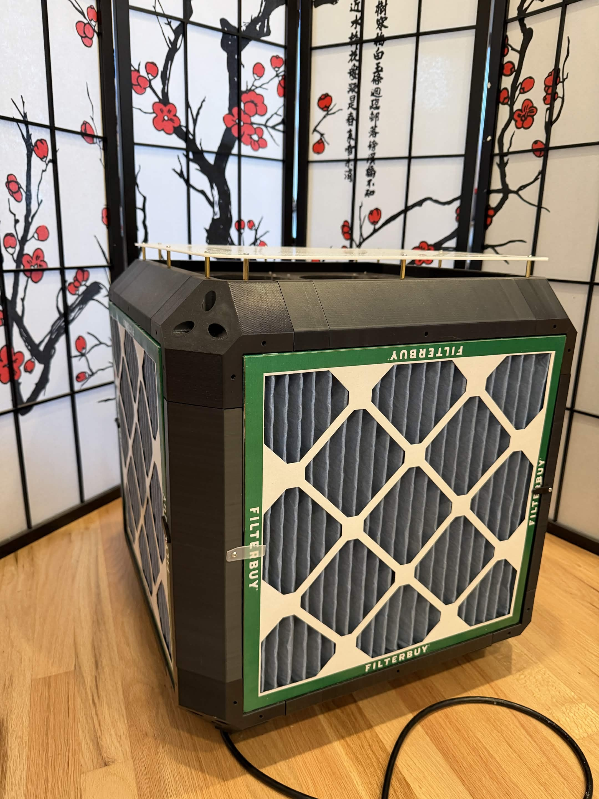
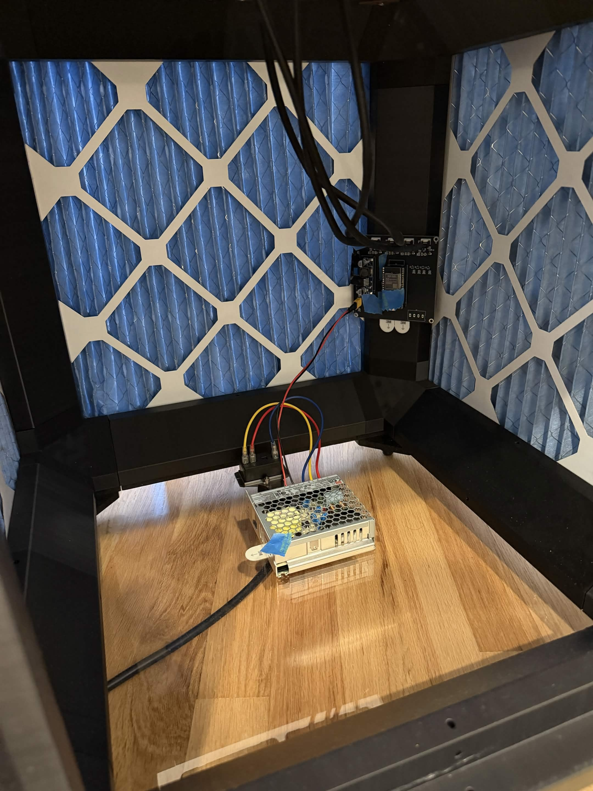
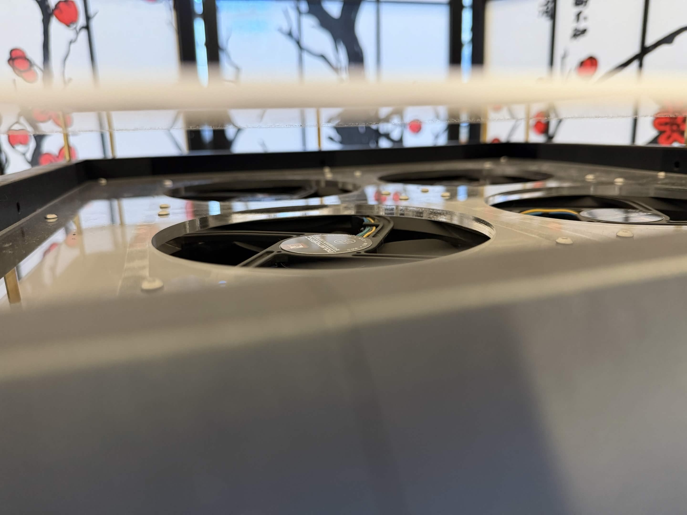

Corsi-Rosenthol Inspired Air Purifier

Onshape Available Here: https://cad.onshape.com/documents/9fe4c8aaf9f949d23d7b46f2/w/0d3218e59a3f068a2d390f4a/e/8d3bb73142d813d5a04eb98a (This Is Based on the version tagged "Public Release")

The concept was to have a Corsi-Rosenthol like design, but a bit more refined.

The big problem that I aimed to address with this design is the difficulty of changing the filters in a regular Corsi-Rosenthol air purifier.

no flow rate tests, because it will heavily depend on the fans you decide to use.

images:

Notes:

I was too lazy to design my own so voltage regulator part used: https://www.amazon.com/dp/B07VVXF7YX

